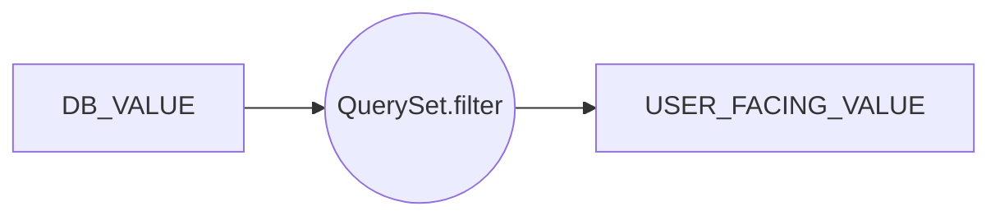

# Django Model简介

ORM是代码（软件）层面对于数据库和关系的一种抽象。Django的Model是ORM的一个具体实现。

## 一、字段（Field）
字段类型及参数的官方文档参考[这里](https://docs.djangoproject.com/en/3.2/ref/models/fields/)。

### （一）字段类型

#### 1. 数值型
| Model字段类型 | Python数据类型 | 备注 |
|--------------|--------------|------|
| AutoField | int(11） | 自增主键，Django Model默认提供id字段，但可以重写 |
| BooleanField | tinyint(1) | |
| DecimalField | decimal | 金融常用，需要指定精确到多少位 |
| IntegerField | int(11) | |
| PositiveIntegerField | int(11) | 非负整数 |
| SmallIntegerField | smallint | 小整数 |

#### 2. 字符型
| Model字段类型 | MySQL数据类型 | 备注 |
|--------------|--------------|------|
| CharField | varchar |  |
| TextField | longtext | 常用于存档大量文本 |
| URLField | varchar | 实现了对URL的特殊处理 |
| UUIDField | char(32) | 在PostgreSQL中使用uuid类型 |
| EmailField | varchar | 实现了对email的特殊处理 |
| FileField | varchar | 实现了对文件的特殊处理 |
| ImageField | varchar | 实现了对图片的特殊处理 |

#### 3. 日期型
- DateField
- DateTimeField
- TimeField

#### 4. 关系型
- ForeignKey
- OneToOneField：在外键字段上加unique
- ManyToManyField：会创建中间表


### （二）字段参数
| 参数名称 | 参数说明 |
|---------|--------|
| null | 数据库层面是否允许为空 |
| blank | 业务层面是否允许为空 |
| choices | 设置选项 |
| db_column | 指定Model和数据库表的字段对应关系 |
| db_index | 配置索引 |
| default | 配置默认值 |
| editable | |
| error_messages | 自定义字段值校验失败的异常提示 |
| help_text | 字段提示语 |
| primary_key | 主键，只允许设置一个字段为主键 |
| unique ||
| unique_for_date | |
| unique_for_month | |
| unique_for_year | |
| verbose_name | 后台显示名称 |
| **validators** | 设置校验逻辑，仅用于form。 |


### （三）字段验证
模型字段中`validators`参数仅用于form，无法校验shell输入的记录。

- built-in：`django.core.validators`

- 用户自定义


## 二、模型

### （一）Model
一个模型对应一张数据库表，`django.db.models.Model`的内部类`Meta`用于配置模型或者表。

- `ordering`：排序的字段。
- `verbose_name`、`verbose_name_plural`，在后台显示的模型名称。
- `unique_together`
- `db_table`：对应的数据库表，默认为`<app_name>_<model_name>`
- `abstract`

Django提供了抽象类的功能。

### （二）Model Manager




继承自`django.db.models.Manager`类，可作为数据在数据库与用户之间的转换，通过模型的`objects`字段配置。一般与自定义的`QuerySet`配合使用。


```python
class ProductQuerySet(models.QuerySet):
  def published(self):
    now = timezone.now()
    return self.filter(state=Product.ProductStateOptions.PUBLISH)


class ProductManager(models.Manager):
  def get_queryset(self):
    return ProductQuerySet(self.model, using=self._db)

  def published(self):
    # Product.objects.published()
    # Product.objects.filter(title__icontains='Title').pushlished()
    return self.get_queryset().published()


class Product(models.Model):
  ...
  objects = ProductManager()
  ...
```


## 三、QuerySet
数据库有数据操作语言DML，可以通过SQL语句进行CRUD操作，在Models对数据库的查询和更新交互通过QuerySet完成，Models可以看成是中间件，具体操作接口可参考[这里](https://docs.djangoproject.com/en/3.2/ref/models/querysets/)。

QuerySet可进行链式操作，需要时才会真正执行DML语句。

### （一）链式调用接口
- all
- filter
- exclude
- reverse
- distinct
- none


### （二）非链式调用接口
- get：不存在会抛出异常
- create
- update
- delete
- get_or_create
- update_or_create
- count
- latest
- earliest
- first
- last
- exists
- bluk_create
- in_buld
- values
- values_list：查看查询结果列表


### （三）查询操作符
常用于filter接口的参数，*字段名*与*参数*之间通过`__`相连。

- contains
- icontains
- startswith
- istartswith
- endswith
- iendswith
- exact
- iexact
- in
- gt
- lt
- gte
- lte
- range
- count


### （四）特殊接口
- defer：把不需要展示的字段延迟加载。
- only：仅加载所需字段。
- select_related：解决外键产生的N+1问题
- prefetch_related：解决多对多关系产生的N+1问题。


### （五）高级查询
- Q表达式用于OR查询。

- F表达式用来执行数据库层面的计算，从而避免多线程竞争。

- 聚合查询
  - Count
  - Sum
  - Avg
  - Min
  - Max

- annotate：增加临时属性。

- aggregate：直接计算结果。

- raw：原生SQL接口


## 四、字段验证（validators）

一般应用目录下的`validators.py`用于模型字段有效的检测。

- 定义字段时，设置validators参数
- 覆写模型的`clean`函数
- 覆写模型的`save`函数，仅本方法对`shell`操作有效