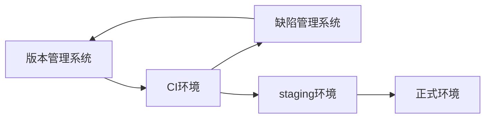
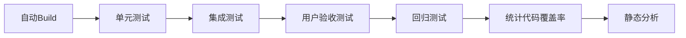

# ITNotes

## Web开发

### 前端
- Vue.js
- 微信小程序

### 后端
- Django(Python)
- Flask(Python)
- Express(Node)

## 数据库

### NoSQL
#### 文档数据库
- [MongoDB](https://www.mongodb.com/)：提供JSON格式的数据，默认端口27017。
    - [Robo 3T](https://robomongo.org/)：MongoDB的GUI工具

#### K-V数据库
- [Memcached](https://memcached.org/)：主要用于缓存数据请求，在内存中快速存取，但对复杂数据类型的支持比较有限，支持分布式。
- [Cassandra](https://cassandra.apache.org/)：支持集群和ad hoc，但对复杂数据结构支持有限，
- [Redis](https://redis.io/)：支持持久性存储，仅用于单机？

### 数据库迁移
数据库迁移工具有：
- Migration（Ruby on Rails）
- south（Django）
- Migrations Plugin（CachePHP）
- Evolution（Play Framework）
- Flyway
- Liquibase
- dbdeploy

## DevOps
版本管理具体包括：代码及其分支管理、数据库模式和数据管理、配置文件管理、依赖关系管理。

DevOps还包括持续集成（CI）和部署自动化、测试自动化。

### 依赖管理
依赖关系方案有：
- JVM语言:Maven（中央仓库）、Sonatype（中央仓库镜像）
    - Apache Ant
    - Maven
    - SBT
    - Gradle
- CPAN：Perl
- PyPI：Python
- RubyGems：Ruby
- npm：Node.js

### 缺陷管理
一般还具备bug管理、代码管理、Wiki等功能。

- [Trac](https://trac.edgewall.org/)：基于Python。
- [Redmine](https://www.redmine.org/)，基于Ruby on Rails。
- [Bugzilla](https://www.bugzilla.org/)：基于Perl。
- [Mantis](https://www.mantisbt.org/)：基于PHP。

商用产品：`JIRA`、`YouTRACK`、`Pivotal Tracker`、`Backlog`、`GITHUB`等SaaS产品。

### 持续集成
持续集成包括自动构建和自动测试。

CI工具有：
- [Jenkins](https://www.jenkins.io/)：定时执行或者轮询执行build任务。
- [TravisCI](https://travis-ci.org/)：GitHub配套的CI工具。

#### 自动构建
Build工具有：make、SCons、Ant、Maven、Gradle、Rake。

#### 自动测试
- 单元测试：与外部系统有交互时候可以利用模拟对象（mock）或桩程序（stub）进行测试；与UI相关的测试，一是编写M层的测试，二是利用Selinium。
    [Mockito](https://site.mockito.org/)：
- 集成测试
- 用户验收测试：利用Selenuim模拟用户。
- 回归测试

#### 统计代码覆盖率
构建过程可以统计代码覆盖率（表示测试对象的应用程序在测试中被执行了多少次），一般的build工具都有统计代码覆盖率的插件，如Cobertura（停止维护）、Jacoco、Scct、SimpleCov、Rcov。

#### 静态分析
在自动测试和统计代码覆盖率的基础上，还可以进一步对代码进行静态分析，Jenkins中使用的静态分析工具有：
- Checkstyle：擅长编码规则的检查。
- PMD：可定制化程度高，对编码规则以及潜在的bug能够检查
- Findbugs：善于检查潜在的bug。

### 持续部署
1. 引导（Bootstraping）：服务器OS的配置及基于虚拟机的服务器安装自动化的相关工具。工具有Vagrant、Cobbler、AWS、Kickstart、Vmware。
2. 配置（Configuration）：服务器及中间件的配置自动化工具。工具有Puppet、Boxen、Chef、serverspec。 
3. 编排（Orchestration）：代码部署及发布相关的服务器操作等自动化工具。工具有Capistrano、Fabric。

目前似乎docker才是主流。

## 测试框架

### TDD（测试驱动开发）
针对程序的API编写测试。
- [JUnit](https://junit.org/junit5/)
- [TestNG](https://testng.org/doc/)

### BDD（行为驱动开发）
确定需求后编写应用的代码，大部分可以接近自然语言的DSL来编写。
- [RSpec](https://rspec.infhttp://mockito.org/o/)
- [Cucumber](https://cukes.info/)：Java语言，根据sample.feature自然语言描述的需求来编写测试代码。
- [Jasmine](https://site.mockito.org/)
- [Specs2](http://etorreborre.github.io/specs2/)

