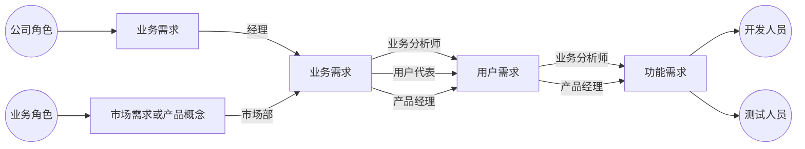
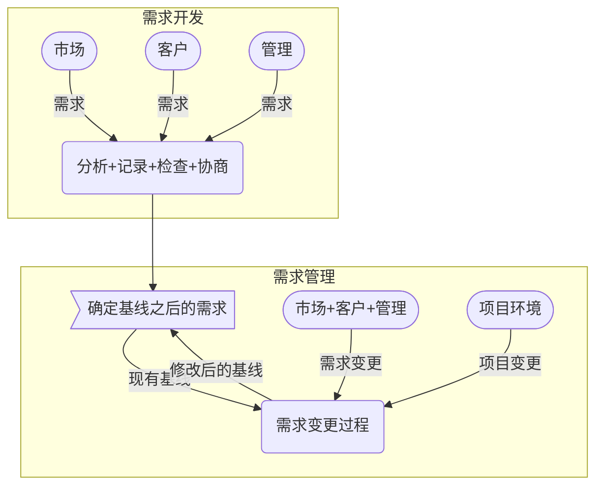
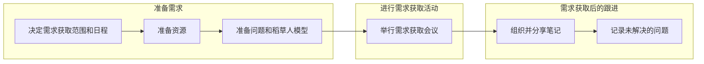
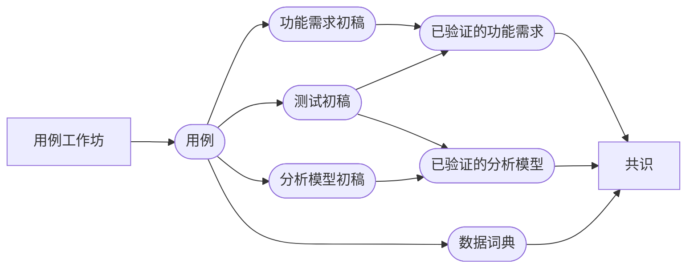

# 软件需求

本文所说的软件需求特指产品需求，聚焦于理解要开发的内容，不包括项目需求，如设计细节、项目计划、测试计划等。

## 一、需求的层次

### （一）业务需求

业务需求通常以愿景和范围文档的形式表现，描述开发产品的组织或者获取产品的客户所需的高层次的业务目标。

业务规则通常包括公司政策、政府法规、工业标准和计算算法。

### （二）用户需求

用户需求通常以用户需求文档的形式表现，如用例、用户故事、事件响应表，描述特定用户群能够用系统完成的目标或者任务，或者是用户期望有的产品属性。

### （三）功能需求

功能需求通常以软件需求说明书（software requirements specification, SRS）的形式表现，描述系统在特定条件下展现的行为。

系统需求包含多个子系统的产品的顶层需求，子系统可以是软件，也可以是软硬件。

非功能需求描述系统必须展现的属性或者特性，或者必须遵守的约束，包括系统的可靠性、易用性、安全性和性能。质量需求是一种非功能需求，描述的是服务或者产品的性能特征。

## 二、需求工程

### （一） 需求工程方法

需求工程一般包括需求开发和需求管理，需求开发进一步细分为获取、分析、规范说明和验证。

用户需求获取的手段有访谈、研讨会、文档分析、原型等。

用户需求获取的策略有**以用途为核心**和**以产品为核心**，以用途为核心强调对用户目标的理解和探求，以产品为核心侧重于特性。

在需求开发的获取阶段，应为产品识别不同的用户组，并为每类用户选出用户代表，在使用频率、所用特性、权限级别方面，这些组别可能不同，以免遗漏任何用户团体的需要。还需要识别出系统事件和反应，外部事件分为3类：控制信号、定时任务、业务事件。

在需求开发的分析阶段，应做好原型创建、接口设计、创建数据字典，将需求分配到子系统中去。

在需求开发的规范说明阶段，应记录好需求源头、业务规则、非功能需求。

在需求开发的验证阶段，应定义好验收标准、设计测试，最好还能模拟需求，使得用户能于模拟系统交互来验证需求和设计决策。

需求管理需要确定需求基线，并预测和协调不可避免且实际存在的变更，最小化变更对项目的影响。

需求管理需要建立需求变更控制流程（定义如何提出、分析和解决需求变更），管理好需求基线，分析需求变更的影响范围，维护需求变更的历史记录，跟踪每个需求的状态。

最好建立一个企业级的知识库，来维护和管理业务术语。

### （二）业务需求

#### 1. 确定业务需求

1. 明确业务价值。定义一套指标体系来衡量业务收益。
2. 明确愿景和范围。从而统一最终目标和当下聚焦。项目范围应该是动态的。
3. 明确项目的首要干系人。用户调研范围尽量全覆盖，但当多方用户需求冲突时，以首要干系人的需求为准。

#### 2. 业务需求模板

1. 业务需求
   1. 背景：总结新产品或对现有产品进行变更的依据和环境，描述产品开发的历史背景或形式。
   2. 业务机遇：对现有产品的对比性评估并指出新产品的吸引力或优势，描述在没有新产品的情况下无法解决的问题，定义关键接口或质量要求，但要略去设计或执行细节。
   3. 业务目标：以定量或可测量的方式总结产品带来的价值。
   4. 成功的标准：定义衡量项目成功的指标。
   5. 愿景声明：总结产品的长远目标和意图。模板如下：
      - 针对【目标客户】
      - 对象【陈述需求或机会】
      - 产品【产品名称】
      - 是【产品类型】
      - 具体的【主要的功能、关键收益、吸引人购买或使用的理由】
      - 不同于【主要竞争产品、当前系统、当前的业务过程】
      - 我们的产品【陈述新产品的主要不同点和优势】
   6. 业务风险：如市场竞争、时机问题、用户接受能力、实现过程中的问题，以及对业务可能造成的消极影响，注意与项目风险的区别。
   7. 业务假设和依赖：业务需求的前提，如果假设错误可能需要变更范围。
2. 范围和限制
   1. 主要特性：列出产品的主要特性或用户功能，并把不同于以前或竞争产品的部分标注出来。
   2. 最初版本的范围：首发版本的功能、质量特性、非功能需求。
   3. 后续版本的范围：发布路线图。
   4. 限制和排除
3. 业务背景
   1. 干系人简介
   2. 项目优先级：从功能、质量、进度、成本、员工5个维度考虑约束、动机、自由度3个因素。
   3. 部署的注意事项

#### 3. 实用图表

##### （1）关联图

关联图（context diagram）直观展示了正在开发的系统和周围所有事物之间的关系，确定通过某一接口与系统相连的外部实体，还包括了数据、控制以及端点和系统之间的物料流转，是数据流图的最高层次抽象。

##### （2）生态系统图

生态系统图（ecosystem map）展示所有与系统利益相关的系统相互作用以及这些互动的本质，还要包括简介影响的系统。

##### （3）特性树

特性树（feature tree）按照逻辑分组展示产品特性，一般显示3个层次。还可以创建一个特色路线图。

##### （4）事件列表

事件列表（event list）确定了可能引发系统行为的外部事件。它描述了系统的范围边界，明确可能被用户触发、时间触发、从外部组件收到的信号事件。

事件列表只列出事件名称，SRS中通过事件——响应列表描述如何响应事件。

### （三）分析用户

从干系人中寻找客户，从客户中识别用户群。

#### 1. 用户来源

可以从组织结构图中寻找，还要记录用户的责任、数量、物理位置。

- 参与业务过程的部门
- 受业务过程影响的部门
- 可能找到的直接或间接用户的部门名称
- 横跨多个部门的用户群
- 与公司外部干系人有接口的部门

#### 2. 用户分类依据

- 访问权限或安全级别
- 业务操作中执行的任务
- 使用的特性
- 使用的频率
- 在应用领域或者计算机专业技能
- 使用的平台
- 直接或简介与系统交互

为了让用户群鲜活，可以为每个用户群创建一个画像，并明确每个群体的用户代表（产品代言人）。产品代言人负责的是用户需求，用户需求对业务需求负责，但业务需求由组织的业务目标和愿景决定。

### （四）用户需求

本节的需求特指用户需求。

#### 1. 需求获取方法

- 访谈
- 工作坊（会议）
- 焦点小组
- 观察
- 问卷调查
- 系统接口分析
- 用户界面分析
- 文档分析

#### 2. 客户输入分类

- 业务需求：描述产品可获得的业务利益。
- 用户需求：描述用户目标、用户需要完成的任务。
- 业务规则：描述特定的用户在特定环境下完成的某项活动。
- 功能需求：描述系统在特定的条件下展示出来的可观察的行为，以及系统允许用户采取的行动。
- 质量属性：描述系统如何很好的完成某些任务。
- 外部接口需求：描述系统与外部世界的联系。
- 约束：描述对开发人员设计和实现的约束。
- 数据需求：描述格式、数据类型、允许值、默认值、复杂的业务数据结构、待生成的报告。
- 解决思路：描述与系统交互使其执行某个动作的一种特定方法。
- 与软件开发无关的项目需求：培训、成本或进度要求。
- 假设或依赖项
- 历史、上下文设置等

### （五）编写用例

**以使用为中心**，通过场景来形成用例方法，以便理解用户需求，从而得到功能需求。

用户故事模板可参考`作为<用户类型>，我想要<一些目标>，以便于<某种原因>`。

用例的作用的从用户需求引出功能需求和测试，但用例本身不应包含设计和数据定义。

- 唯一的ID、一个简洁名称（指明用户目标）
- 创建人、来源
- 角色：
  - 首要角色
  - 次要角色
- 描述：一段关于用例意图的简短的文字说明
- 开始执行用例的触发条件
- 用例开始执行的前置条件
- 用例成功完成系统的状态（后置条件）
- 一个有编号的步骤列表，描述角色与系统之间的交互顺序
  - 正常流程
  - 可选流程
  - 异常
- 其他信息
  - 优先级
  - 使用频率
  - 业务规则
  - 假设

### （六）记录业务规则

业务规则需要由功能需求来保证执行。

#### 1. 业务规则分类

- 事实：业务在某个特定时间点简单而正确的陈述。
- 约束：限制系统或其用户可执行的行为。
  - 组织政策
  - 政府法规
  - 行业标准
- 触发规则：当特定条件满足时触发某些活动的规则。
- 推理：从已知的事实中产生新的事实。
- 运算：通过使用特定的数学公式或算法将已知的数据加工为新的数据。

#### 2. 业务规则模板

- ID
- 规定定义
- 规则类型
- 静态或动态
- 来源

### （七）需求规格说明书

#### 1. SRS模板

1. 引言
   1. 目的
   2. 文档约定
   3. 项目范围：将软件与用户、公司目标、业务目标和策略相关联。如果是增量式发布，还要包括自身的范围。
   4. 参考文献
2. 综合描述
   1. 产品前景
   2. 用户类别及特征
   3. 运行环境
   4. 设计和实现约束
   5. 假设与依赖
3. 系统特性
   1. X系统特性1
      1. 描述
      2. 功能需求
4. 数据需求
   1. 逻辑数据模型
   2. 数据字典
   3. 报告
   4. 数据获取、整合、保存和处理
5. 外部接口需求
   1. 用户界面
   2. 软件接口
   3. 硬件接口
   4. 通信接口
6. 质量属性
   1. 可用性
   2. 性能
   3. 保密性
   4. 安全性
   5. 其他
7. 国际化和本地化需求
8. 其他需求
9. 词汇表
10. 分析模型

#### 2. 用户故事

敏捷项目一般不编写软件需求规格说明书，而是采用用户故事。

用户故事经过积累并按优先级排入一个动态的产品backlog，随着每次迭代不断完善故事细节。

用户认可度描述如果故事正确执行，系统的表现如何，以此来展示故事细节。

#### 3. 实用图标

- 数据流图（data flow diagram, DFD）：数据流+数据加工+数据存储+外部实体
- 流程图（泳道图）
- 状态转换图
- 对话图
- 决策表和决策树
- 事件——响应表：事件+系统状态+系统响应
- 需求树
- 用例图
- 活动图
- 实体关系图

### （八）数据需求

## 三、业务分析师

业务分析师的职责是获取、分析、记录和验证项目干系人的需要，有时由产品经理来兼任。工作任务是理解项目的业务目标，然后定义出用户、功能和质量需求，然团队进行估算和计划项目，最后设计、开发和验证产品。

## 参考资料

- 软件需求（第3版）, 2016, Karl Wiegers & Joy Beatty, 李忠利等译, 清华大学出版社.